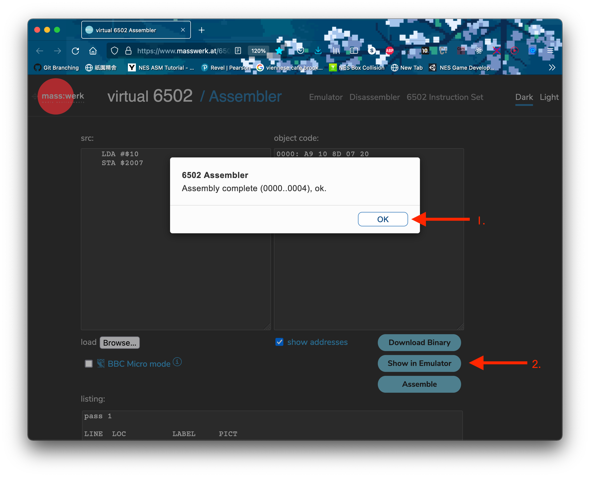
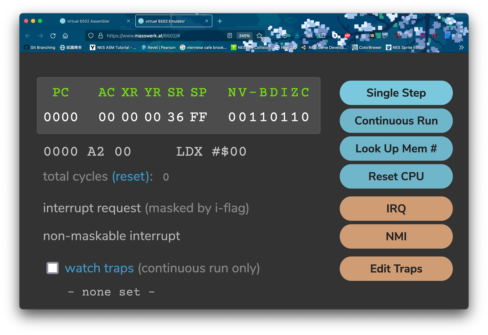
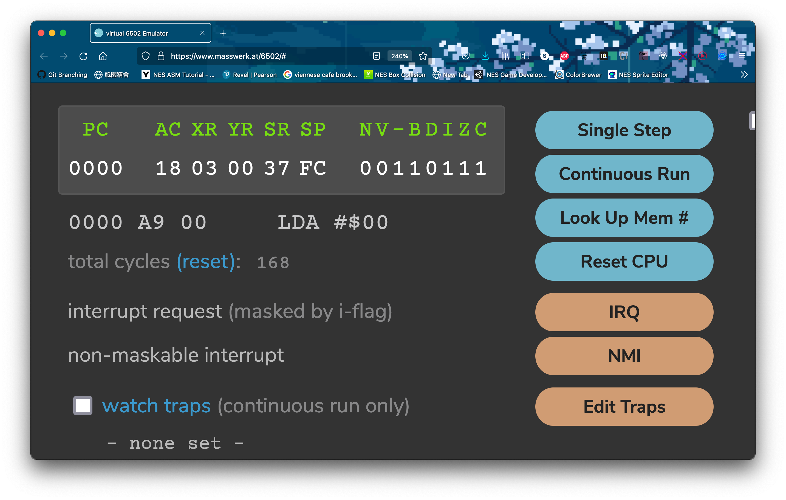
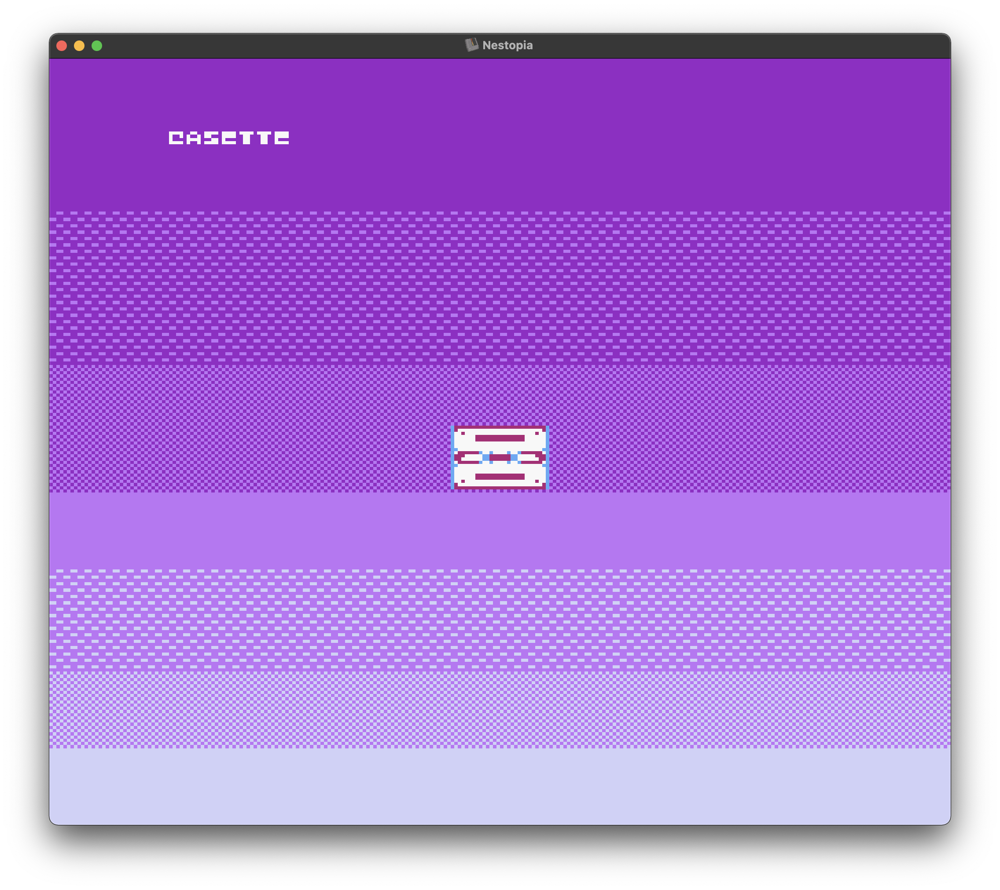
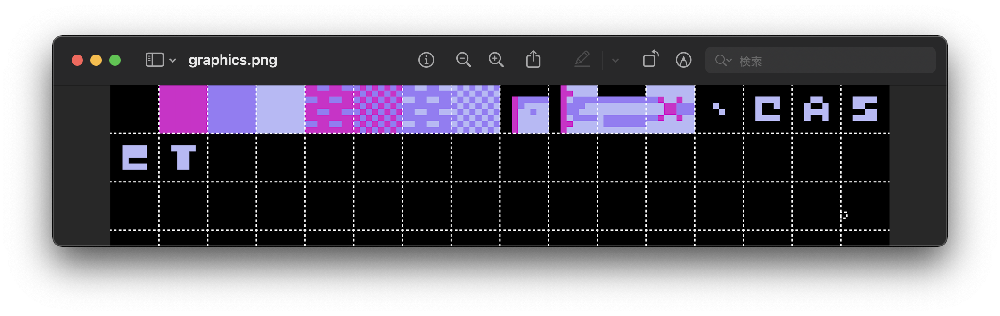
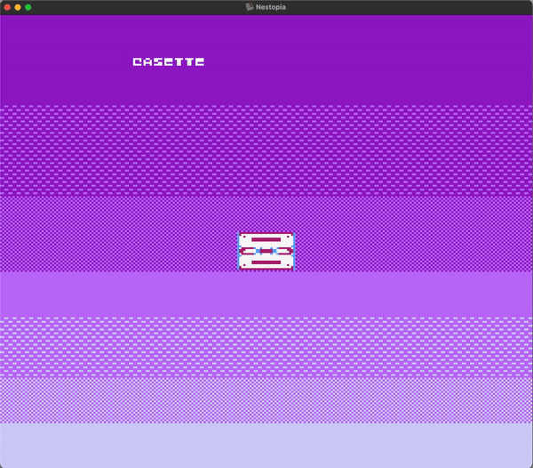

<h2 align=center>Demo Lecture</h2>

<h1 align=center>Game Programming in Assembly</h1>

### 21 Vendémiaire Year CCXXXI

***Song of the day***: _[**Life During Wartime**](https://youtu.be/jLwZvg46jms) by Talking Heads (2022)._

### Sections

1. [**Introduction**](#part-1-introduction)
2. [**Assembly Operations**](#part-2-assembly-operations)
    1. [**Moving Data Around**](#moving-data-around)
    2. [**Branching And Looping**](#branching-and-looping)
3. [**Simple Animation**](#part-3-simple-animation)
4. [**Physics**](#part-4-physics)
5. [**Controller Input**](#part-5-controller-input)

### Part 1: _Introduction_

> _If you know whence you came, there are absolutely no limitations to where you can go._ 
>
> – James Baldwin.

One of the questions I'm often asked is why I made the transition to computer science if my undergraduate degree was in chemical engineering. While the overarching answer to this can be generally boiled down to a "because I wanted to do something that I _actually_ enjoyed," it was, of course, a much more nuanced process. As a fan of video games and "old tech" in general, one of the first topics in computer science that I became interested in was how Nintendo Entertainment System (NES) era games were made. As I was just barely starting my CS journey at the time, most of what I found was ancient documentation that I barely understood–but, more surprisingly, I found that an NES "homebrew" community existed and _actively_ developed new games using the assembly language of old, 6502.

Now, I, myself, feel like I've only scratched the surface of this field but, as a professor of computer science, I inevitably asked myself the question of whether there was any value in learning (and potentially teaching) NES game development in a modern university setting. I'm sure the answers to this will vary wildly from person to person–the NES is, after all, over forty years old and 6502 assembly is essentially obsolete. I tend to answer this question with another one: is there any value in learning Latin, a dead language?

Regardless of whether you want to answer "yes" or you want to say "no," the reality is that learning Latin not only enhances our cognitive pattern-matching abilities, but it also enhances our English-speaking abilities and helps us understand the finer nuances of language. The parallel in 6502 and NES development is thus: you will likely never use it in your day job, sure, but having the ability to develop playable software with a minimal set of syntactical tools, interacting so closely with our machines, is no mean feat–and you will only gain a more nuanced understanding of the tools that we _do_ use everyday.

Plus, game development is never not fun to get into, regardless of its form.

### Part 2: _Assembly Operations_

Alright, provided that I've at least partially convinced you to follow along, let's get right into the 6502 that we'll need today. Feel free to follow along with this [**virtual assembler**](https://www.masswerk.at/6502/assembler.html), which I will also be using.

#### ***Moving Data Around***

Fundamentally speaking, all assembly programming is about is the transfer of numbers from one place to another. This is certainly true of game development in 6502. For instance, let's say we wanted to put (10)<sub>16</sub> into memory location `2007` (in practical NES development terms, this would be equivalent to telling the PPU to "display" whatever the data point (10)<sub>16</sub> might represent–a sprite, for example).

In 6502, we have different forms of using values–a process known as _addressing_. The two forms of addressing that we need to be aware of are:

- **Immediate Addressing**: Preceded by a `#`, these values are literals used directly to perform computations.
- **Absolute Addressing**: A full 16-bit address is specified and the byte at that address is used to perform a computation.

With this in mind, take a look at the following lines of code:

```asm
    LDA #$10   ; load hex 10 into accumulator
    STA $2007  ; store the value of accumulator to location 2000
```

<sub>**Code Block 1**: Note that, similar to many modern assembly languages, instructions are preceded by a tab of whitespace.</sub>

In 6502 assembly, hexadecimal values are preceded by a `$`, and binary values by `%`. `%00000001` is, for example, (1)<sub>2</sub>.

If we take a look at the result of this operation in our virtual assembler:





<sub>**Figures 1 – 4**: The emulated result of the assembly and running code block 1.</sub>

#### ***Branching and Looping***

Perfect. Now we need a way to automate these operations. In high-level programming languages, this would be the job of a `while`- or a `for`-loop. We don't have such control-flow structures in assembly, so instead we must manually tell the program to return to an earlier point in our program if a certain condition is true. This is known as **branching**. For this, we can make use of either of the following 6502 instructions:

- **`CMP`/ `CPY` / `CPX` (compare with accumulator / Y register / X register)**: Compares the current value stored inside the accumulator / Y register / X register with another.
- **`BNE` (branch on not equal)**: Go to a certain location in the program, denoted by a label, if the result of a comparison is false.
- **`BEQ` (branch on equal)**: Go to a certain location in the program, denoted by a label, if the result of a comparison is true.

With these in mind, the way we could loop over something, say, four times, would be as follows:

```asm
LIMIT = $04     ; we can assign labels to addresses

    LDX #$00    ; x = 0
Loop:
    INX  ; x++
    CPX #LIMIT  : x == LIMIT

                ; the code that we want to loop would go here

    BNE Loop    ; if x != LIMIT, jump to the Loop label
```

<sub>**Code Block 2**: The code below the `Loop` label would run four times.</sub>

Let's run this code in our virtual assembler and load a number into the accumulator _after_ the loop is done as a sanity check. This should only happen if the loop has ended:





<sub>**Figures 5 – 11**: The emulated result of the assembly and running code block 2. Notice that, as figure 11 shows, (10)<sub>16</sub> isn't loaded into the accumulator until after the loop is through. This can be used for sentinel control (i.e. a `while`-loop).</sub>

So, if we used one of our three registers to create one loop, how would we create a nested loop? Repeat the exact same process with the other two registers!

```asm
INNER = $04
OUTER = $03

    LDA #$00        ; a = 0

    LDX #$00        ; x = 0
    LDY #$00        ; y = 0
OuterLoop:
    INX             ; x++ while y < INNER
InnerLoop:
    INY             ; y++ while y < INNER

    CLC             ; clear carry flag
    ADC #2          ; let's add 2 to the accumulator every time the inner loop runs

    CPY #INNER
    BNE InnerLoop

    LDY #$00        ; reset y to 0

    CPX #OUTER      ; Once x == OUTER, stop
    BNE OuterLoop
```

<sub>**Code Block 3**: A nested loop.</sub>



<sub>**Figure 12**: Our registers after the execution of code block 3. Notice that whenever we add a number to the accumulator (`ADC` / add with carry), we need to clear the carry flag (`CLC`) in case the previous operation left a carry.</sub>

This is essentially all we need to know to get started with some simple development: the ability to load data en-masse. Let's get right to it.

### Part 3: _Simple Animation_

If we assemble and run [**cassette.asm**](cassette.asm), we should see the following screen:

```commandline
➜  game-programming-in-assembly git:(main) ✗ make    
nesasm cassette.asm
NES Assembler (v3.1)

pass 1
pass 2
➜  game-programming-in-assembly git:(main) ✗ make run
open cassette.nes -a nestopia
```


<sub>**Figure 13**: A nice cassette sprite, along with a banner with the word "cassette", doing absolutely nothing on screen.</sub>

The spritesheet that went into this design can be seen below:



<sub>**Figure 14**: Created using [**this**](https://eonarheim.github.io/NES-Sprite-Editor/) online tool. Notice that only four sprites went into creating our cassette sprite, which is actually 12 sprites put together. More on how that works later.</sub>

Let's start with getting some basic movement. I would like the "cassette" banner to move constantly to the right and loop around to the left of the screen, as if it were a stock market signboard. This would imply a couple of things:

1. Loading up the data of each specific sprite.
2. Accessing each sprite's horizontal location sub-data.
3. Increasing its value in the direction that corresponds to the right direction (translation transformation in game programming parlance).
4. Saving the result back into the sprites's corresponding location in memory.

How are we to accomplish this? Elsewhere in the program, the [**data**](assets/banks/sprites.asm) concerning the location and orientation of these sprites was loaded up into a specific location exclusive to sprite data (in this program, the location chosen was `$0300`, or `SPRITE_RAM`). Lets take a look at the data of the first letter of `cassette`:

```asm
    .db $14, $0D, %00000000, $20  ; C
```

What can we glean from this? `db` simply means "define byte(s)", and is followed by four bytes corresponding to the `c` sprite. Each sprite consists, then, of 4 bytes of data:

1. Vertical screen position (top left corner)
2. Graphical tile (hex value of the tile [**in the sprite sheet**](assets/images/sprite-data.png))
3. Attributes (%76543210):
    - Bits 0 and 1 are for the colour palette
    - Bits 2, 3, and 4 are not used
    - Bit 5 is priority (0 shows the sprite in front of the background, and 1 displays it behind it)
    - Bit 6 flips the sprite horizontally (0 is normal, 1 is flipped)
    - Bit 7 flips the sprite vertically (0 is normal, 1 is flipped)
4. Horizontal screen position (top left corner)

Awesome, so it looks like sprite number 4 is our ticket forwards. Inside [**cassette.asm**](cassette.asm), locate the following label, which is where we will program our banner movement:

```asm
RotateText:
    ; TODO
    RTS
```

<sub>**Code Block 4**: Here, `RTS` basically marks the end of our `RotateText` subroutine, so it will need to be the last line. Just note that the `RTS` instruction implies that `RotateText` was "called" from somewhere else in the program. In this case, it was from the `NMI` routine, which runs every single frame.</sub>

Cool, so let's start implementing our 4-step plan from above. Since we're not only dealing with one sprite, but rather eight adjacent ones, what programming structure that we just learned can we use to apply the same process to all of them? A loop!

```asm
RotateText:
    LDX #$00    ; x = 0
.StringLoop:
    INX

    ; TODO - Loading up the data of each specific sprite.
    ; TODO - Accessing each sprite's horizontal location sub-data.
    ; TODO - Increasing its value in the direction that corresponds to the right direction (translation transformation in game programming parlance).
    ; TODO - Saving the result back into the sprites's corresponding location in memory.

    CPX ; TODO - How many times should this loop run?
    BNE .StringLoop
```

<sub>**Code Block 5**: Here, the `.` before `StringLoop` denotes that it is a section belonging to the `RotateText` subroutine.</sub>

In 6502, the only register that can perform math operations is the accumulator, so it is always a good idea to use it to do stuff like translations (even if it's just an increment). We said earlier that the sprites were all saved in memory starting at location `$0300`. If the `c` sprite were the first sprite to be loaded up, then this would be the first location that we would load, but the `c` sprite is actually the 14th sprite to be saved into memory, so it's starting location is actually at memory location `$0333`. Let's apply the label `STRNG_STRT` to this location for convenient:

```
    STRNG_STRT
     ($0300)
        v
... ––– C1 ––– C2 ––– C3 ––– C4
                              |
        A4 ––– A3 ––– A2 ––– A1
        |
        S1 ––– S2 ––– S3 ––– S4
                              |
        T4 ––– T3 ––– T2 ––– T1
        |
        E1 ––– E2 ––– E3 ––– E4 ––– ...
```

<sub>**Figure 15**: A visualisation of how each of the four bytes dedicated to each letter are stored in memory–contiguously (that is, stored right next to each other in memory).</sub>

6502 assembly has this gnarly way of addressing data that is contiguous called **absolute indexed** addressing. This effectively means that we can offset which location we are accessing by a certain index. For example, if we wanted to load the value stored 3 bytes away from location `$0100`, we would do the following:

```asm
    LDA $0100,#$03
```

This looks like perfect for our needs, since we know our starting point. We can also figure out the amount of times this loop will run with some simple math. If there are 4 letters in the word "cassette", and each letter comprises for 4 bytes, then the "size" of this sprite string is 8 × 4 = (32)<sub>10</sub> = (20)<sub>16</sub>. Let's call this value `STRNG_SIZE`:

```asm
RotateText:
    LDX #$00 ; x = 0
    LDY #$00 ; y = 0
.StringLoop:
    LDA STRNG_STRT,X  ; Load the location of (0th + x)th letter

    ; TODO - Increasing its value in the direction that corresponds to the right direction (translation transformation in game programming parlance).
    ; TODO - Saving the result back into the sprites's corresponding location in memory.

    INX              ; x++

    CPX #STRNG_SIZE  ; Once x == STRNG_SIZE, stop
    BNE .StringLoop

    RTS
```

<sub>**Code Block 6**: Here, we are offsetting the location `LDA` is loading by the current value stored in the x register.</sub>

Speaking of offsets, we have a bit of a problem here. `INX` is incrementing the value stored in the x register every time it is called within the loop. This would be great if every sprite's horizontal location byte were located right next to each other, but as we can see in figure 15, this is not the case. Each sprite's first byte contains the horizontal location, but it is then followed by the 3 more bytes of information before we reach the next sprite's horizontal location byte.

Meaning: we have to increment not by 1, but by 4. The problem here is that the only register in the 6502 microprocessor that is able to perform arithmetic and / or be offset by a value is the accumulator, so we can't simply just add 4 to the x register. It was when I first faced this limitation that I really started to feel the limitations of the 6502 assembly language, but it need not be a bad thing. Working with limitations is how we get creative, and in this case, the solution is not too far out.

Instead of adding 4 to the x register in one go, let's add 1 to it four times. In other words, we need another loop inside of our main loop:

```asm
RotateText:
    LDX #$00           ; x = 0
    LDY #$00           ; y = 0
.StringLoop:
    LDA STRNG_STRT,X   ; load the location of (0th + x)th letter

    CLC                ; clear the carry flag
    ADC #$01           ; add 1 to the value stored in the acc (aka translate to the right by 1)
    STA STRNG_STRT,X   ; store the incremented value the location of (0th + x)th memory location

.CharacterLoop:
    INX                ; x++ while y < 4
    INY                ; y++ while y < 4

    CPY #$04           ; once y == 4, stop CharacterLoop
    BNE .CharacterLoop

    LDY #$00           ; reset y to 0

    CPX #STRNG_SIZE    ; once x == STRNG_SIZE, stop StringLoop
    BNE .StringLoop

    RTS
```

<sub>**Code Block 7**: Our finished `RotateText` subroutine.</sub>

Let's see it in action!



<sub>**Figure 16**: Animation in assembly: complete!</sub>

### Part 4: _Physics_

### Part 5: _Controller Input_
