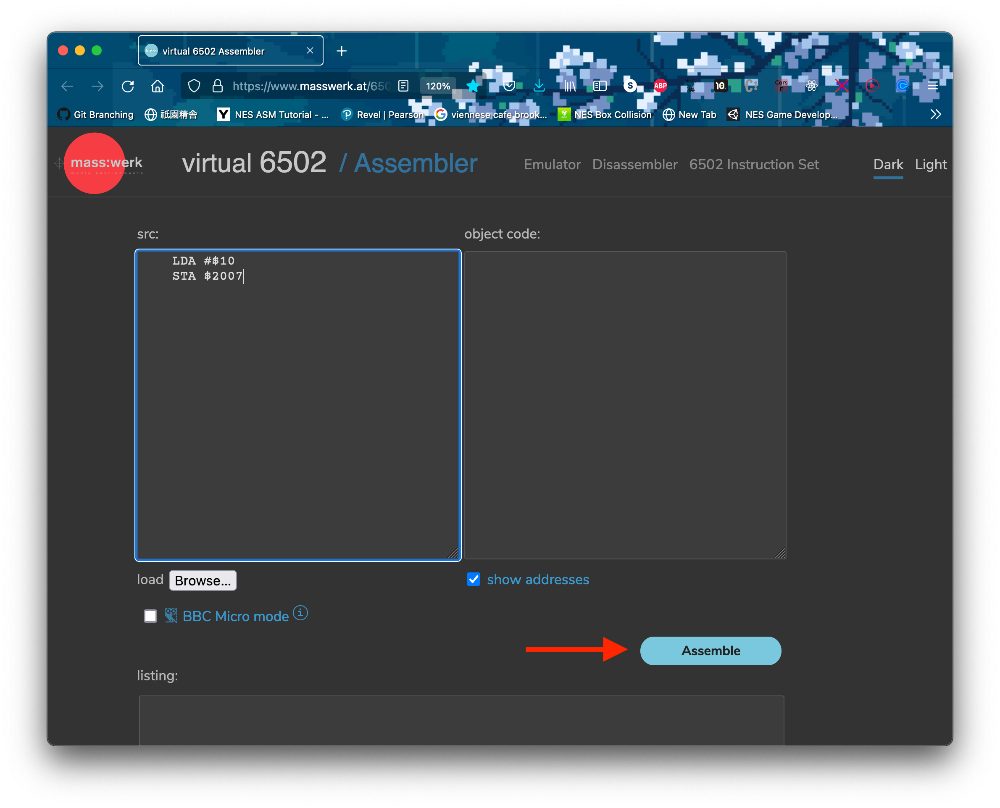
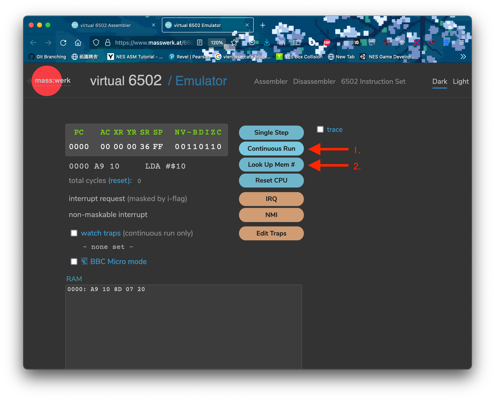
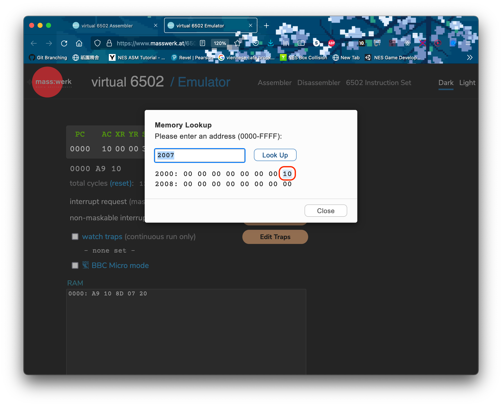
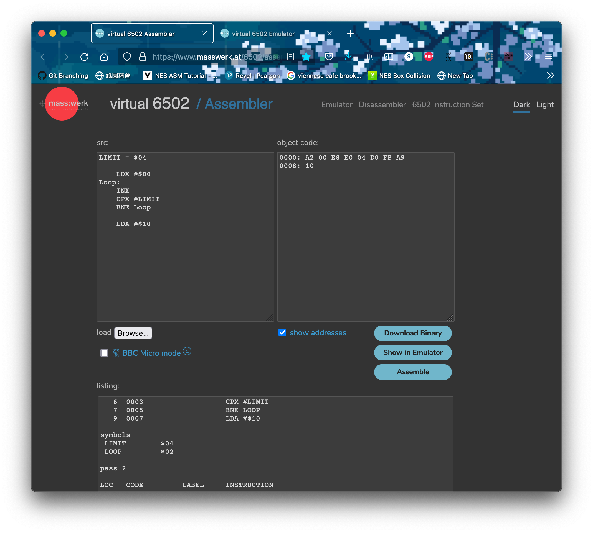
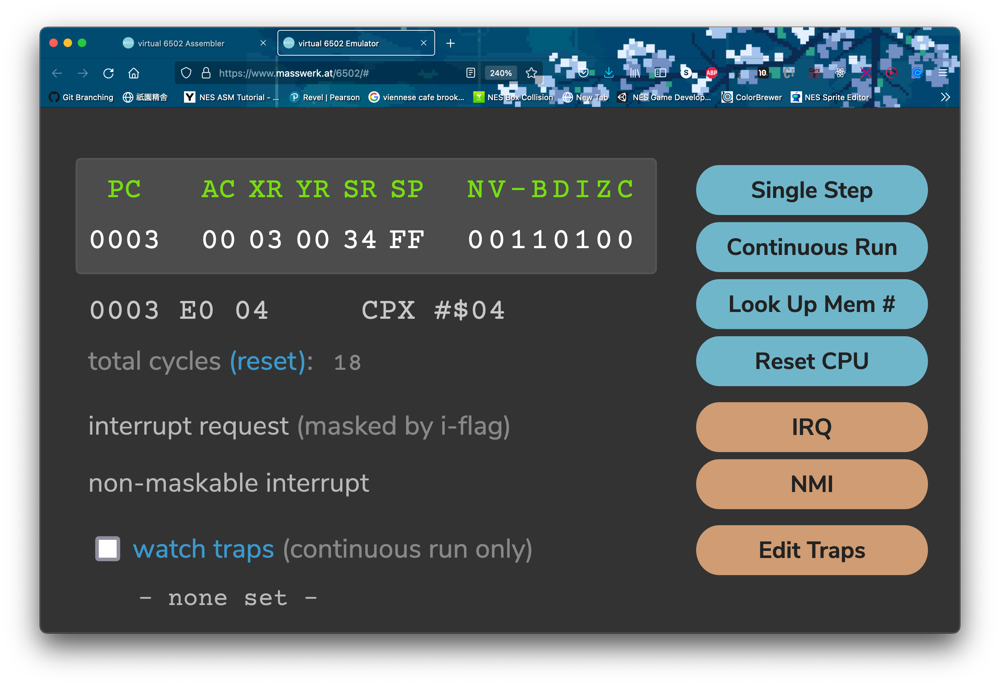

<h2 align=center>Demo Lecture</h2>

<h1 align=center>Game Programming in Assembly</h1>

### 21 Vendémiaire Year CCXXXI

***Song of the day***: _[**Life During Wartime**](https://youtu.be/jLwZvg46jms) by Talking Heads (2022)._

### Sections

1. [**Introduction**](#part-0-introduction)
2. [**Assembly Operations**](#part-1-assembly-operations)
3. [**Simple Animation**](#part-2-the-interface-perspective)
4. [**Physics**](#part-3-in-the-wild)
5. [**Controller Input**](#part-4-controller-input)

### Part 1: _Introduction_

> _If you know whence you came, there are absolutely no limitations to where you can go._ 
>
> – James Baldwin.

One of the questions I'm often asked is why I made the transition to computer science if my undergraduate degree was in chemical engineering. While the overarching answer to this can be generally boiled down to a "because I wanted to do something that I _actually_ enjoyed," it was, of course, a much more nuanced process. As a fan of video games and "old tech" in general, one of the first topics in computer science that I became interested in was how Nintendo Entertainment System (NES) era games were made. As I was just barely starting my CS journey at the time, most of what I found was ancient documentation that I barely understood–but, more surprisingly, I found that an NES "homebrew" community existed and _actively_ developed new games using the assembly language of old, 6502.

Now, I, myself, feel like I've only scratched the surface of this field but, as a professor of computer science, I inevitably asked myself the question of whether there was any value in learning (and potentially teaching) NES game development in a modern university setting. I'm sure the answers to this will vary wildly from person to person–the NES is, after all, over forty years old and 6502 assembly is essentially obsolete. I tend to answer this question with another one: is there any value in learning Latin, a dead language?

Regardless of whether you want to answer "yes" or you want to say "no," the reality is that learning Latin not only enhances our cognitive pattern-matching abilities, but it also enhances our English-speaking abilities and helps us understand the finer nuances of language. The parallel in 6502 and NES development is thus: you will likely never use it in your day job, sure, but having the ability to develop playable software with a minimal set of syntactical tools, interacting so closely with our machines, is no mean feat–and you will only gain a more nuanced understanding of the tools that we _do_ use everyday.

Plus, game development is never not fun to get into, regardless of its form.

### Part 2: _Assembly Operations_

Alright, provided that I've at least partially convinced you to follow along, let's get right into the 6502 that we'll need today. Feel free to follow along with this [**virtual assembler**](https://www.masswerk.at/6502/assembler.html), which I will also be using.

#### ***Moving Data Around***

Fundamentally speaking, all assembly programming is about is the transfer of numbers from one place to another. This is certainly true of game development in 6502. For instance, let's say we wanted to put (10)<sub>16</sub> into memory location `2007` (in practical NES development terms, this would be equivalent to telling the PPU to "display" whatever the data point (10)<sub>16</sub> might represent–a sprite, for example).

In 6502, we have different forms of using values–a process known as _addressing_. The two forms of addressing that we need to be aware of are:

- **Immediate Addressing**: Preceded by a `#`, these values are literals used directly to perform computations.
- **Absolute Addressing**: A full 16-bit address is specified and the byte at that address is used to perform a computation.

With this in mind, take a look at the following lines of code:

```asm
    LDA #$10   ; load hex 10 into accumulator
    STA $2007  ; store the value of accumulator to location 2000
```

<sub>**Code Block 1**: In 6502 assembly, hexadecimal values are preceded by a `$`, and binary values by `%`. `%00000001` is thus (1)<sub>2</sub>. Also of note is that, similar to many modern assembly languages, instructions are preceded by a tab of whitespace.</sub>

If we take a look at the result of this operation in our virtual assembler:






<sub>**Figures 1 – 4**: The emulated result of the assembly and running code block 1.</sub>

#### ***Branching and Looping***

Perfect. Now we need a way to automate these operations. In high-level programming languages, this would be the job of a `while`- or a `for`-loop. We don't have such control-flow structures in assembly, so instead we must manually tell the program to return to an earlier point in our program if a certain condition is true. This is known as **branching**. For this, we can make use of either of the following 6502 instructions:

- **`CMP`/ `CPY` / `CPX` (compare with accumulator / Y register / X register)**: Compares the current value stored inside the accumulator / Y register / X register with another.
- **`BNE` (branch on not equal)**: Go to a certain location in the program, denoted by a label, if the result of a comparison is false.
- **`BEQ` (branch on equal)**: Go to a certain location in the program, denoted by a label, if the result of a comparison is true.

With these in mind, the way we could loop over something, say, four times, would be as follows:

```asm
LIMIT = $04     ; we can assign labels to addresses

    LDX #$00    ; x = 0
Loop:
    INX  ; x++
    CPX #LIMIT  : x == LIMIT

                ; the code that we want to loop would go here

    BNE Loop    ; if x != LIMIT, jump to the Loop label
```

<sub>**Code Block 2**: The code below the `Loop` label would run four times.</sub>

Let's run this code in our virtual assembler and load a number into the accumulator _after_ the loop is done as a sanity check. This should only happen if the loop has ended:







<sub>**Figures 5 – 11**: The emulated result of the assembly and running code block 2. Notice that, as figure 11 shows, (10)<sub>16</sub> isn't loaded into the accumulator until after the loop is through. This can be used for sentinel control (i.e. a `while`-loop).</sub>

So, if we used one of our three registers to create one loop, how would we create a nested loop? Repeat the exact same process with the other two registers!

```asm
INNER = $04
OUTER = $03

    LDA #$00        ; let's add #2 to the accumulator every time the inner loop runs

    LDX #$00
    LDY #$00
OuterLoop:
    INX             ; x++ while y < INNER
InnerLoop:
    INY             ; y++ while y < INNER

    CLC             ; clear carry flag
    ADC #2          ; add 2

    CPY #INNER
    BNE InnerLoop

    LDY #$00        ; reset y to 0

    CPX #OUTER      ; Once x == OUTER, stop
    BNE OuterLoop
```

<sub>**Code Block 3**: A nested loop.</sub>


<sub>**Figure 12**: Our registers after the execution of code block 3. Notice that whenever we add a number to the accumulator (`ADC` / add with carry), we need to clear the carry flag (`CLC`) in case the previous operation left a carry.</sub>

This is essentially all we need to know to get started with some simple development: the ability to load data en-masse. Let's get right to it.

### Part 3: _Simple Animation_

### Part 4: _Physics_

### Part 5: _Controller Input_
