<h2 align=center>October 13th, 2022</h2>
<p align=center><sup><em>(updated on August 2nd, 2023)</em></sup></p>

<h1 align=center><em>Nintendo Entertainment System:</em> Game Programming in Assembly</h1>

<h3 align=center>Sebastián Romero Cruz</h3>
<p align=center><sup><em>(they / them)</em></sup></p>

***Song of the day***: _[**Life During Wartime**](https://youtu.be/jLwZvg46jms) by Talking Heads (2022)._

### Sections

0. [**Abstract**](#abstract)
    1. [**Motivation**](#motivation)
    2. [**Topics**](#topics)
    3. [**Materials**](#materials)
    4. [**Pre-Requisites**](#pre-requisites)
    5. [**Speaker**](#speaker)
1. [**Introduction**](#part-1-introduction)
2. [**Assembly Operations**](#part-2-assembly-operations)
    1. [**Moving Data Around**](#moving-data-around)
    2. [**Branching And Looping**](#branching-and-looping)
3. [**Simple Animation**](#part-3-simple-animation)
4. [**Controller Input**](#part-4-controller-input)
    1. [**Checking For An Active Bit**](#checking-for-an-active-bit)
    2. [**Changing Colour Palettes**](#changing-colour-palettes)
    3. [**Keeping Variables**](#keeping-variables)
    4. [**Manipulating Specific Bits In A Byte**](#manipulating-specific-bits-in-a-byte)
5. [**Conclusion**](#part-5-conclusion)

### **Abstract**

#### **Motivation**

Since its humble beginnings in the 70s as specialised hardware, video game development has matured into an integrated and accessible practice; modern developers can now realise an entire project without having to write a single line of code. Even if one does, one hardly ever has to worry about the behaviour that contemporary game engines, such as Unity and Unreal—and even modern libraries such as OpenGL and Metal—abstract away. While the democratisation of a field is certainly not a bad thing, due to this general trend the historical and intrinsic role that hardware has played in game programming is often underappreciated—an unfortunate loss, considering that it can prove to be an immersive and creative tool in computer architecture pedagogy.

The following lecture will cover the three basic game design principles of **animation**, **physics**, and **controller input** through the lens of an assembly language with only three general-purpose, 8-bit registers and minimal memory allowance. Students will thus gain a reinforced command of computer architecture, low-level programming, and a general awareness of game development practices.

#### **Topics**

1. **Assembly Operations**: Loops
2. **Simple Animation**: Sprite Movement
3. **Controller Input**: Bitwise Operations

#### **Materials**

This lecture is designed to be actively followed by any who wish to write code along with the professor. For those interested in following the examples included in the lecture, feel free to use the following online tools:

- [**6502 Virtual Assembler**](https://www.masswerk.at/6502/assembler.html)
- [**nestopia**](https://nestopia.sourceforge.net/) NES emulator
- [**6502 Assembly Instruction Set**](https://www.masswerk.at/6502/6502_instruction_set.html)
- [**NES Sprite Editor**](https://eonarheim.github.io/NES-Sprite-Editor/)

#### **Pre-Requisites**

Being rather old and with spotty online documentation, previous knowledge of the specific [**syntax rules and quirks**](https://en.wikibooks.org/wiki/6502_Assembly) of 6502 assembly is not necessary. However, a solid background in memory management, computer architecture, bitwise operations and manipulation, and _an_ assembly language is encouraged and might result in a more rewarding experience.

#### **Speaker**

**Professor Sebastián Romero Cruz** _(b. Mexico City, México)_ is a adjunct computer science instructor at both NYU Tandon School of Engineering and Pace University's Seidenberg School Of Computer Science and Information Systems. 

Having received their undergraduate degree in chemical and biomolecular engineering and their graduate degree in computer science, they encourage a multi-faceted, inclusive approach to programming pedagogy. This policy, combined with a philosophy of complete and unconditional empathy for students of varying backgrounds and needs, are the means through which their courses are administered.

Outside of computer science, Prof. Romero Cruz enjoys learning about French history and impressionism, playing music, and studying the Japanese language.

---

### Part 1: _Introduction_

> _If you know whence you came, there are absolutely no limitations to where you can go._ 
>
> – James Baldwin.

As both a fan of "retro" video games and a professor of computer science, I often ask myself the question of whether there is any value in learning (and potentially teaching) game development from the 70s and 80s in a modern university setting. I'm sure the answers to this will vary wildly from person to person–the NES _is_, for example, over forty years old and 6502 assembly is essentially obsolete. But I actually think that this question is better answered by postulating a new one: is there any value in learning Latin, a dead language?

Regardless of whether you want to answer "yes" or "no," the reality is that learning Latin not only enhances our cognitive pattern-matching abilities, but it also helps us structure our English-speaking abilities, and helps us understand the finer shades of language. The parallel in 6502 and NES development is that, yes, you will likely never use it in your day job, but having the ability to develop playable software with a minimal set of syntactical tools, interacting so closely with our machines, is no small feat–and you will only gain a better understanding of the tools that we _do_ use everyday.

Plus, game development is never not fun to get into, regardless of its form.

### Part 2: _Assembly Operations_

Alright, provided that I've at least partially convinced you to follow along, let's get right into the 6502 that we'll need today. Feel free to follow along with this [**virtual assembler**](https://www.masswerk.at/6502/assembler.html), which I will also be using.

#### ***Moving Data Around***

Fundamentally speaking, all assembly programming is about is the transfer of numbers from one place to another. This is certainly true of game development in 6502. For instance, let's say we wanted to put hex (10)<sub>16</sub> into memory location `2007` (in practical NES development terms, this would be equivalent to telling the PPU to "display" whatever the data point (10)<sub>16</sub> might represent–a sprite, for example).

In 6502, we have different forms of using values–a process known as _addressing_. The two forms of addressing that we need to be aware of are:

- **Immediate Addressing**: Preceded by a `#`, these values are literals used directly to perform computations. That is, if you want to load up any plain old number, this is what you would use.
- **Absolute Addressing**: A full 16-bit address is specified and the byte at that address is used to perform a computation. That is, you are not using the value you are addressing, but rather the number stored at that memory location.

With this in mind, take a look at the following lines of code:

```asm
    LDA #$10   ; immediate addressing–load hex 10 into accumulator
    STA $2007  ; absolute addressing–store the value of accumulator to location 2007
```

<sub>**Code Block 1**: Note that, similar to many modern assembly languages, instructions are preceded by a tab of whitespace.</sub>

Here, we are loading the hex number 10 and then storing it in the A register, or the accumulator (in 6502 assembly, hexadecimal values are preceded by a `$`, and binary values by `%`. `%00000001` is, for example, (1)<sub>2</sub>). In the 6502, we have three general purpose registers that we can use for operations: A, X, and Y.

If we take a look at the result of this operation in our virtual assembler:

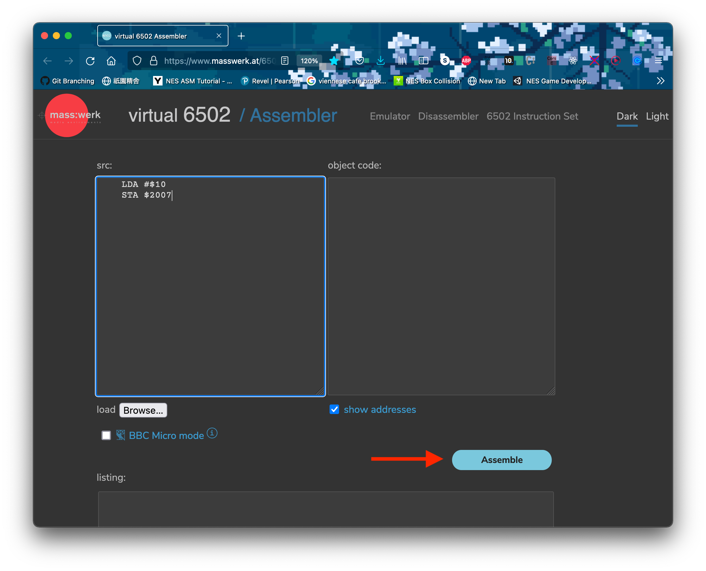
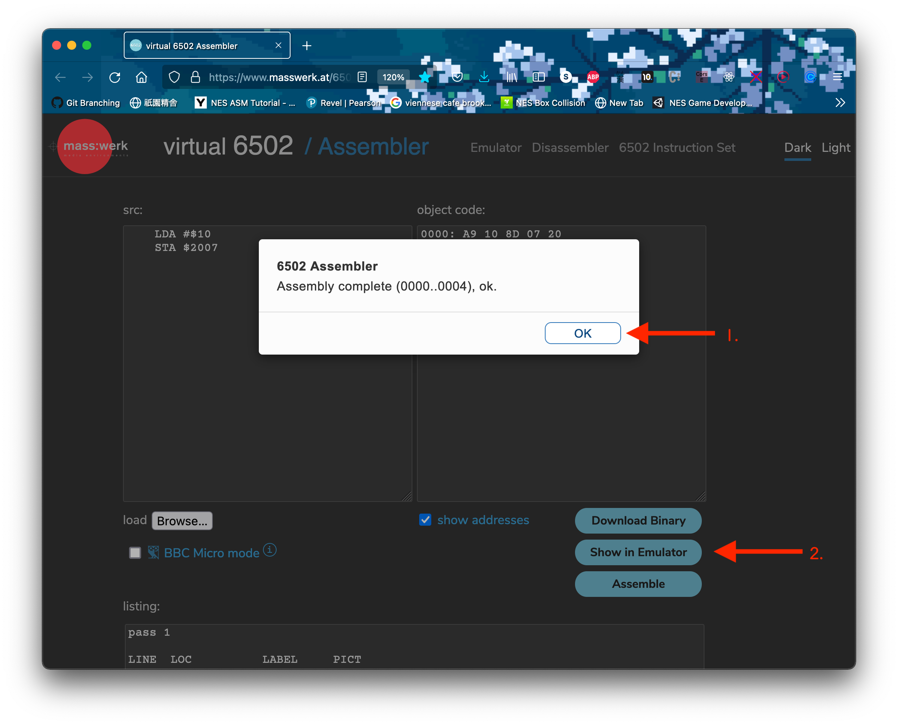
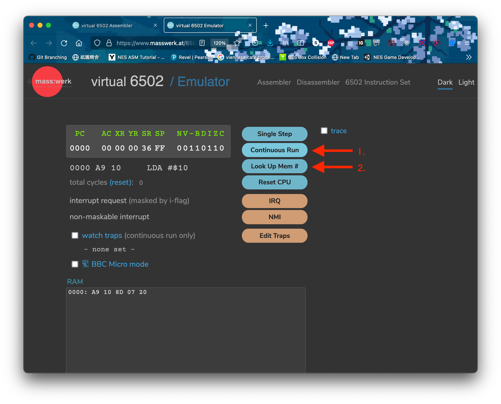
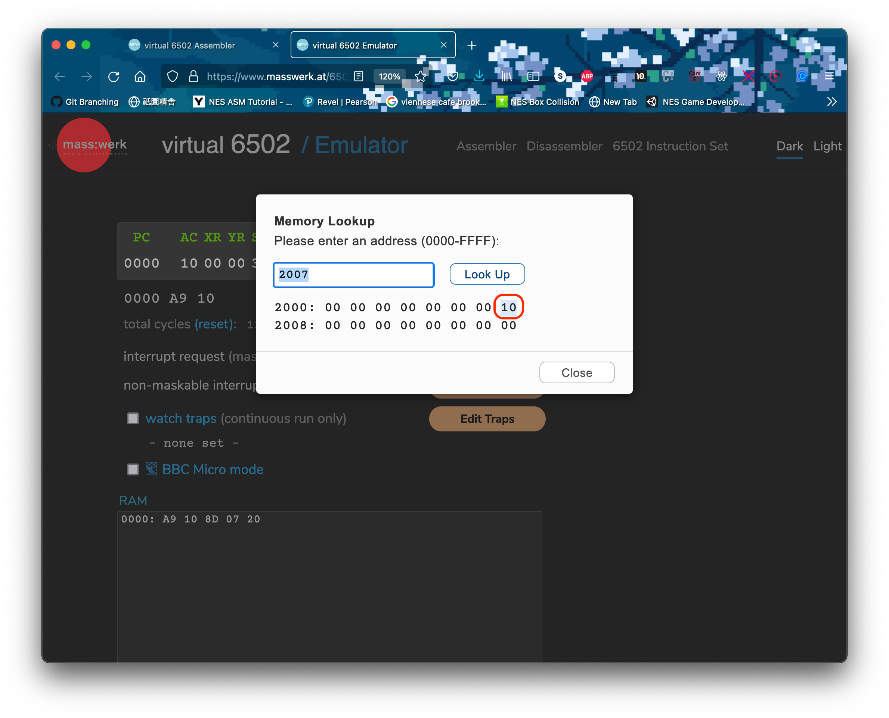

<sub>**Figures 1 – 4**: The emulated result of the assembly and running code block 1.</sub>

Looks good.

#### ***Branching and Looping***

Now, we need a way to automate these operations. In high-level programming languages, this would be the job of a `while`- or a `for`-loop. We don't have such control-flow structures in assembly, so instead we must manually tell the program to return to an earlier point in our program if a certain condition is true. This is known as **branching**. For this, we can make use of either of the following 6502 instructions:

- **`CMP`/ `CPY` / `CPX` (compare with accumulator / Y register / X register)**: Compares the current value stored inside the accumulator / Y register / X register with another.

After we make a comparison, we can use either of the following to branch depending on the result:

- **`BNE` (branch on not equal)**: Go to a certain location in the program, denoted by a label, if the result of a comparison is false.
- **`BEQ` (branch on equal)**: Go to a certain location in the program, denoted by a label, if the result of a comparison is true.

With these in mind, the way we could loop over something, say, four times, would be as follows:

```asm
LIMIT = $04     ; we can assign labels to addresses

    LDX #$00    ; x = 0
Loop:
    INX         ; x++
    CPX #LIMIT  ; x == LIMIT

                ; the code that we want to loop would go here

    BNE Loop    ; if x != LIMIT, jump to the Loop label

    LDA #$10    ; this line of code will only run after the loop is over
```

<sub>**Code Block 2**: The code below the `Loop` label would run four times. Note the use of the X register as our "loop variable".</sub>

Let's run this code in our virtual assembler and load a number into the accumulator _after_ the loop is done as a sanity check:

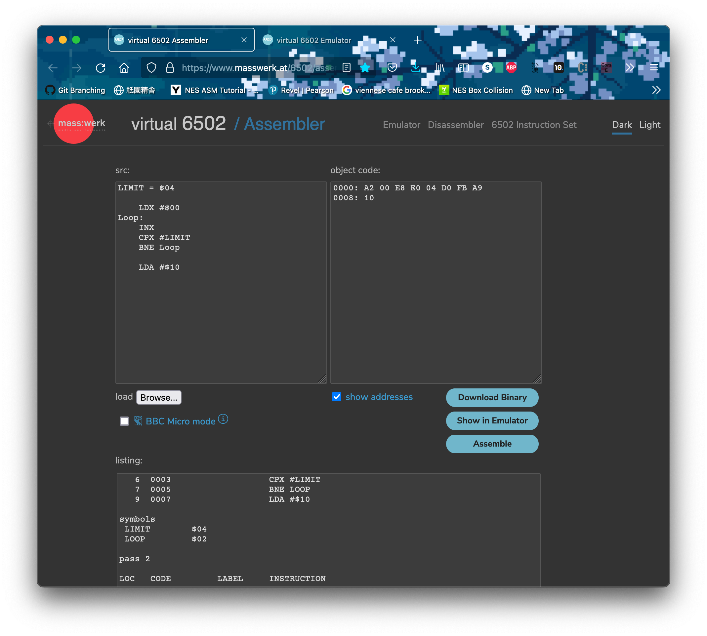
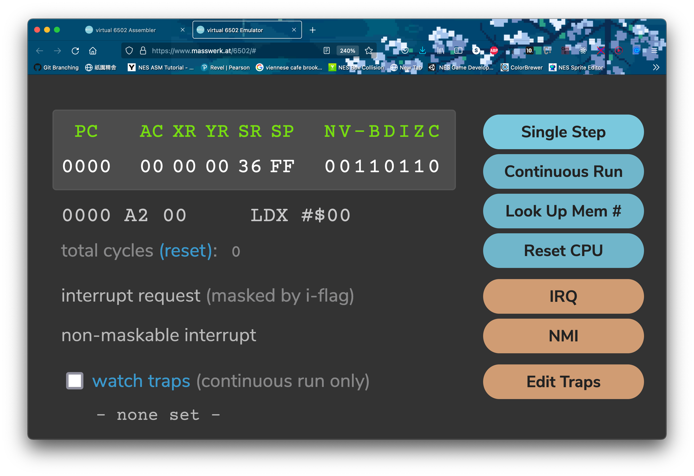


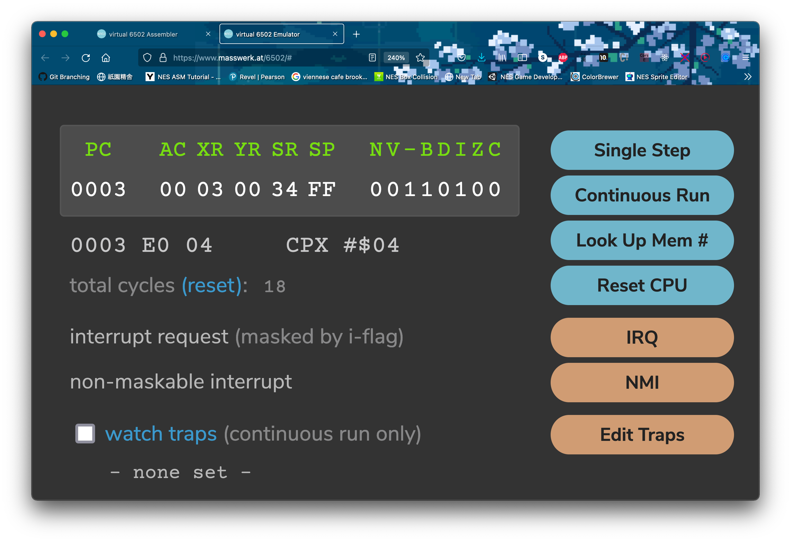


<sub>**Figures 5 – 11**: The emulated result of the assembly and running code block 2. Notice that, as figure 11 shows, (10)<sub>16</sub> isn't loaded into the accumulator until after the loop is through. This can be used for sentinel control (i.e. a `while`-loop).</sub>

So, if we used one of our three registers to create one loop.

Since we have two other registers, we can use them to create a nested loop. This operation is super common in NES dev, as we shall see. Let's add a literal 2 to the accumulator inside the inner loop to demonstrate:

```asm
INNER = $04
OUTER = $03

    LDA #$00        ; a = 0

    LDX #$00        ; x = 0
    LDY #$00        ; y = 0
OuterLoop:
    INX             ; x++ while y < INNER
InnerLoop:
    INY             ; y++ while y < INNER

    CLC             ; clear carry flag
    ADC #2          ; let's add 2 to the accumulator every time the inner loop runs

    CPY #INNER
    BNE InnerLoop

    LDY #$00        ; reset y to 0

    CPX #OUTER      ; Once x == OUTER, stop
    BNE OuterLoop
```

<sub>**Code Block 3**: A nested loop.</sub>

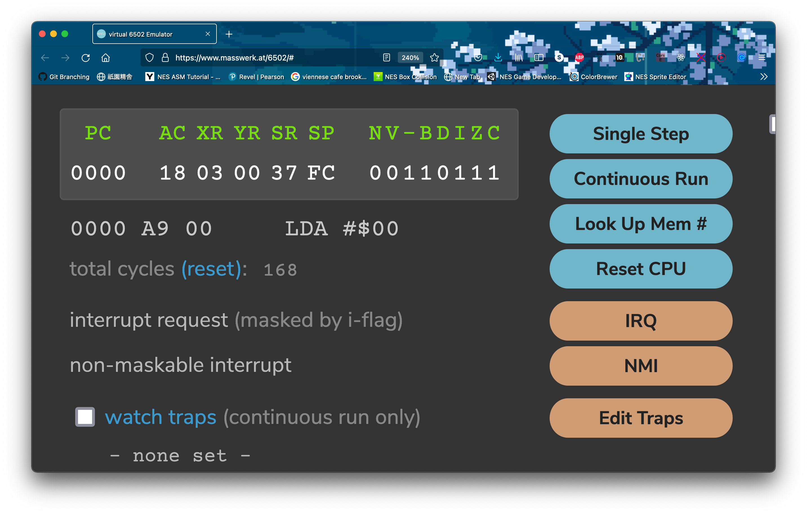

<sub>**Figure 12**: Our registers after the execution of code block 3. Notice that whenever we add a number to the accumulator (`ADC` / add with carry), we need to clear the carry flag (`CLC`) in case the previous operation left a carry.</sub>

This is essentially all we need to know to get started with some simple development: the ability to load data en-masse. Let's get right to it.

### Part 3: _Simple Animation_

I have included an incomplete version of one of my personal projects for us to work in.

If we assemble (`make` in the command line) and run [**cassette.asm**](cassette.asm) (`make run` in the command line`), we should see the following screen:

```commandline
➜  game-programming-in-assembly git:(main) ✗ make    
nesasm cassette.asm
NES Assembler (v3.1)

pass 1
pass 2
➜  game-programming-in-assembly git:(main) ✗ make run
open cassette.nes -a nestopia
```
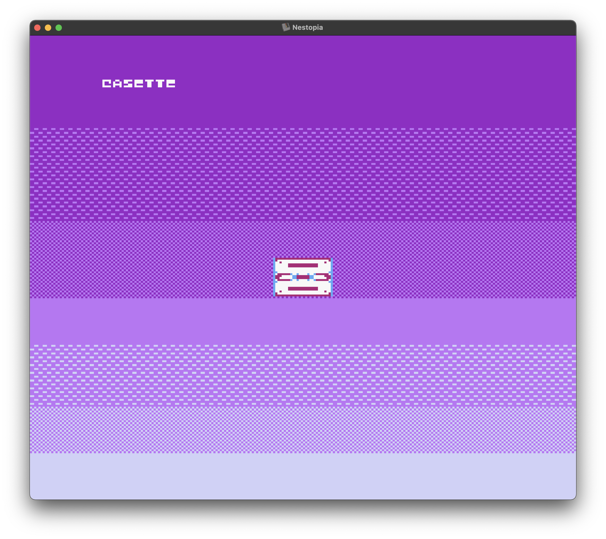

<sub>**Figure 13**: A nice cassette sprite, along with a banner with the word "cassette", doing absolutely nothing on screen. Keep in mind that you will need to have [**nestopia**](https://nestopia.sourceforge.net/), and NES emulator, for these commands to work.</sub>

The spritesheet that went into this design can be seen below:

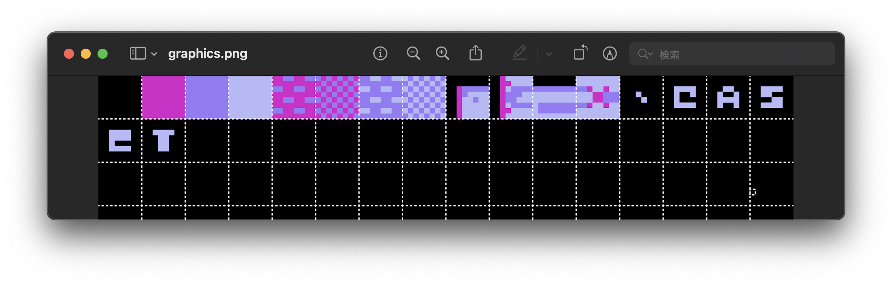

<sub>**Figure 14**: Created using [**this**](https://eonarheim.github.io/NES-Sprite-Editor/) online tool. Notice that only four sprites went into creating our cassette sprite, which is actually 12 sprites put together. More on how that works later.</sub>

Let's start with getting some basic movement. I would like the "cassette" banner to move constantly to the right and loop around to the left of the screen, as if it were a stock market signboard. This would imply a couple of things:

1. Loading up the data of each specific tile (i.e. the `c` tile, the `a` tile, etc).
2. Accessing the portion of each tile's data that contains its horizontal location.
3. Increasing its value in the direction that corresponds to the right direction (translation transformation in game programming parlance).
4. Saving the result back into the tile's corresponding location in memory.

How are we to accomplish this? 

Elsewhere in the program, the [**data**](assets/banks/sprites.asm) concerning the location and orientation of these sprites was loaded up into a specific location exclusive to sprite data (in this program, the location chosen was `$0300`, which I have given the label `SPRITE_RAM`). 

Let's take a look at the data of the first letter of `cassette`:

```asm
    .db $14, $0D, %00000000, $20  ; C
```

What can we glean from this? `.db` simply means "define byte(s)", and is followed by four bytes corresponding to the `c` sprite. Each sprite consists, then, of 4 bytes of data:

1. Vertical screen position (top left corner)
2. Graphical tile (hex value of the tile [**in the sprite sheet**](assets/images/sprite-data.png))
3. Attributes (more on this in the next section)
4. Horizontal screen position (top left corner)

Awesome, so it looks like byte number 4 is our ticket forwards. Inside [**cassette.asm**](cassette.asm), locate the following label, which is where we will program our banner "movement":

```asm
RotateText:
    ; TODO
    RTS
```

<sub>**Code Block 4**: Here, `RTS` basically marks the end of our `RotateText` subroutine, so it will need to be the last line. Just note that the `RTS` instruction implies that `RotateText` was "called" from somewhere else in the program. In this case, it was from the `NMI` routine, which runs every single frame.</sub>

Cool, so let's start implementing our 4-step plan from above. 

Since we're not only dealing with one tile, but rather eight adjacent ones, what programming structure that we just learned can we use to apply the same process to all of them? A loop!

```asm
RotateText:
    LDX #$00    ; x = 0
.StringLoop:
    INX

    ; TODO - 1. Loading up the data of each specific tile.
    ; TODO - 2. Accessing each tile's horizontal location sub-data.
    ; TODO - 3. Increasing its value in the direction that corresponds to the right direction (translation transformation in game programming parlance).
    ; TODO - 4. Saving the result back into the tile's corresponding location in memory.

    CPX ; TODO - How many times should this loop run?
    BNE .StringLoop
```

<sub>**Code Block 5**: Here, the `.` before `StringLoop` denotes that it is a section belonging to the `RotateText` subroutine. Consider it an inner subroutine inside `RotateText`'s scope.</sub>

In 6502, **the only register that can perform math operations is the accumulator (A register)**, (although the X and Y register can perform increments of 1 using `INX` and `INY`) so it is always a good idea to use it to do stuff that involves math (even if it's just an increment by 1).

We said earlier that the tiles were all saved in memory, starting at location `$0300`, right? Now, if the `c` tile were the first tile to have been loaded up, then this would be the location that we would start loading from. But the `c` tile is actually the 14th tile to be saved into memory, so its starting location is actually at memory location `$0333`. 

Let's apply the label `STRNG_STRT` to this location for convenience. Visually, you can think of it looking like this:

```
    STRNG_STRT
     ($0333)
        v
... ––– C1 ––– C2 ––– C3 ––– C4
                              |
        A4 ––– A3 ––– A2 ––– A1
        |
        S1 ––– S2 ––– S3 ––– S4
                              |
        S4 ––– S3 ––– S2 ––– S1
        |
        E1 ––– E2 ––– E3 ––– E4
                              |
        T4 ––– T3 ––– T2 ––– T1
        |
        T1 ––– T2 ––– T3 ––– T4
                              |
... ––– E4 ––– E3 ––– E2 ––– E1
```

<sub>**Figure 15**: A visualisation of how each of the four bytes dedicated to each letter are stored in memory–contiguously (that is, stored right next to each other in memory). `1` corresponds to the vertical position byte, `2` corresponds to the the tile byte, `3` the attributes byte, and `4` the horizontal position byte.</sub>

6502 assembly has this gnarly way of addressing data that is contiguous called **absolute indexed** addressing. This effectively means that we can offset which location we are accessing by a certain index. For example, if we wanted to load the value stored 3 bytes away from location `$0100`, we would do the following:

```asm
    LDA $0100,#$03
```

This is perfect for our needs, since we know our starting point, `STRNG_STRT`. 

We can also figure out the amount of times this loop will run with some simple math. If there are 8 letters in the word "cassette", and each letter comprises for 4 bytes, then the "size" of this tile string is 8 × 4 = (32)<sub>10</sub> = (20)<sub>16</sub>.

Let's call this value `STRNG_SIZE`:

```asm
RotateText:
    LDX #$00          ; x = 0
.StringLoop:
    LDA STRNG_STRT,X  ; Load the location of (0th + x)th letter

    ; TODO - Increment value in the direction that corresponds to the right direction (translation transformation in game programming parlance).
    ; TODO - Saving the result back into the tile's corresponding location in memory.

    INX               ; x++

    CPX #STRNG_SIZE   ; Once x == STRNG_SIZE, stop
    BNE .StringLoop

    RTS
```

<sub>**Code Block 6**: Here, we are offsetting the location that `LDA` is loading by the current value stored in the X register.</sub>

Speaking of offsets, we have a bit of a problem here. `INX` is incrementing the value stored in the x register by 1. Now, this would be fine if every tile's horizontal location byte were located right next to each other, but as we can see in figure 15, this is not the case. A tile's fourth byte contains the horizontal location, but it is then followed by the 3 more bytes of information before we reach the next tile's horizontal location byte.

Meaning: we have to increment not by 1, but by 4. The problem here, again, is that the only register in the 6502 microprocessor that is able to perform arithmetic and / or be offset by a value is the accumulator, so we can't simply just add 4 to the X register. 

Honestly, it was when I first faced this dilemma that I really started to feel the limitations of the 6502 assembly language, but it need not be a bad thing. Working with limitations is how we get creative, and in this case, the solution is not too far out.

Instead of adding 4 to the X register in one go, let's add 1 to it four times. In other words, we need another loop inside of our main loop:

```asm
RotateText:
    LDX #$00           ; x = 0
    LDY #$00           ; y = 0
.StringLoop:
    LDA STRNG_STRT,X   ; load the location of (0th + x)th letter

    CLC                ; clear the carry flag
    ADC #$01           ; add 1 to the value stored in the acc (aka translate to the right by 1)
    STA STRNG_STRT,X   ; store the incremented value the location of (0th + x)th memory location

.CharacterLoop:
    INX                ; x++ while y < 4
    INY                ; y++ while y < 4

    CPY #$04           ; once y == 4, stop CharacterLoop
    BNE .CharacterLoop

    LDY #$00           ; reset y to 0

    CPX #STRNG_SIZE    ; once x == STRNG_SIZE, stop StringLoop
    BNE .StringLoop

    RTS
```

<sub>**Code Block 7**: Our finished `RotateText` subroutine.</sub>

Let's see it in action!

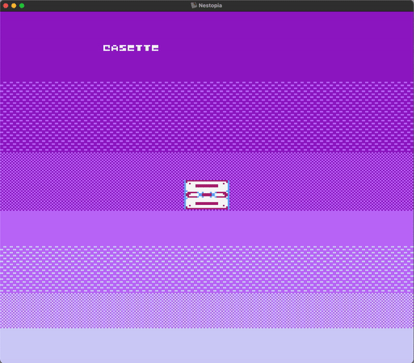

<sub>**Figure 16**: Animation in assembly: complete!</sub>

### Part 4: _Controller Input_

Okay, so we know how to make things move in NES games.

But the whole point of video games is having the _player_ make things happen with the controller–that's what makes them _games_. Reading for controller input is surprisingly simple when developing for the NES. One simply just has to, every frame:

1. Activate the controller port.
2. Check if any of the buttons of the NES controller are pressed. This is done in the following order:
    1. Check if A is pressed.
    2. Check if B is pressed.
    3. Check if the start button is pressed.
    4. Check if the select button is pressed.
    5. Check if the down button is pressed.
    6. Check if the left button is pressed.
    7. Check if the right button is pressed.

That's basically it as far as check for button presses is concerned. The function skeleton in our assembly file, then...

```asm
ReadControllerInput:
    ; TODO
    RTS
```

We can start to fill this up a little. We can activate the controller by loading up the literal value of 1 into the register responsible for controller 1 (`$4016`, which we'll label as `CNTRLRONE` here). 

However, since the CPU's address bus requires that we give it a 16-bit address, we have to "fill out" this activation sequence by loading a 0 into the same address (`#$01` is a four-bit value):

```asm
ReadControllerInput:
    LDA #$01         ; activate controller by loading 1
    STA CNTRLRONE    ; into $4016 and
    LDA #$00         ; "pad" the activation with a 0
    STA CNTRLRONE    ; since it's a 16-bit address
```

After the controller is activated, loading the value stored in `CNTRLRONE` again, once for each of the seven buttons, will let us know if the button was pressed. 

```asm
ReadControllerInput:
    LDA #$01         ; activate controller by loading 1
    STA CNTRLRONE    ; into $4016 and
    LDA #$00         ; "pad" the activation with a 0
    STA CNTRLRONE    ; since it's a 16-bit address

    ;; Read button input: A -> B -> Select -> Start -> Up -> Down -> Left -> Right
    LDA CNTRLRONE   ; A
    LDA CNTRLRONE   ; B
    LDA CNTRLRONE   ; Select
    LDA CNTRLRONE   ; Start
    LDA CNTRLRONE   ; Up
    LDA CNTRLRONE   ; Down
    LDA CNTRLRONE   ; Left
    LDA CNTRLRONE   ; Right

    RTS
```

<sub>**Code Block 8**: Loading either 1 or 0 from each of the button presses—although we are not actually doing anything with the result.</sub>

So, how exactly do we activate a button? Here, we introduce one of my favourite things about NES development: bitwise operations.

#### ***Checking For An Active Bit***

The byte loaded from of `CNTRLRONE` either has a 1 at its most significant bit (rightmost, since the 6502 is [**little endian**](https://en.wikipedia.org/wiki/Endianness)) if a specific button is pressed, and a 0 if it isn't pressed. Therefore, we must find a way to check if that bit and only that bit is switched on to 1. For this, we perform an `and` operation with this value against a binary `%00000001`:

```
CNTRLRONE  --> XXXXXXX0                | --> XXXXXXX1
                 AND                   |       AND
BINARY_ONE --> 00000001                | --> 00000001
———————————————————————————————————————————————————————————————
result     --> XXXXXXX0 (not pressed)  | --> XXXXXXX1 (pressed)
```

<sub>**Figure 17**: The two potential results of a bitwise `and` operation on `CNTRLRONE` and (1)<sub>2</sub>, where `X` represents in this case an irrelevant bit.</sub>

Let's handle moving to the right if the player presses the right button, since we're already aquatinted with the basics of this operation:

```asm
ReadControllerInput:
    LDA #$01         ; activate controller by loading 1
    STA CNTRLRONE    ; into $4016 and
    LDA #$00         ; "pad" the activation with a 0
    STA CNTRLRONE    ; since it's a 16-bit address

    ;; Read button input: A -> B -> Select -> Start -> Up -> Down -> Left -> Right
    LDA CNTRLRONE   ; A
    LDA CNTRLRONE   ; B
    LDA CNTRLRONE   ; Select
    LDA CNTRLRONE   ; Start
    LDA CNTRLRONE   ; Up
    LDA CNTRLRONE   ; Down
    LDA CNTRLRONE   ; Left

ReadRight:
    LDA CNTRLRONE   ; Right

    ; Translate right

EndReadRight:
```

Think of `EndReadRight` as the label we'll just straight to if the button wasn't pressed.

To perform an `and` operation, we do the following:

```asm
ReadRight:
    LDA CNTRLRONE     ; load either a 0 or a 1
    AND #%00000001    ; AND with binary 1
    CMP #0
    BEQ EndReadRight  ; branch to the end of the subroutine if button wasn't pressed

    ; Translate right

EndReadRight:
```

<sub>**Code Block 9**: This of this as an `if`-statement checking for a button press that would `return` right away if there wasn't an actual press detected.</sub>

Nice. Now, we perform the same steps to move all of the cassette tiles involved in making our sprite to the right as we did with the banner:

1. Load the horizontal location of the current tile, starting at the location of the first tile in the sequence (in this case, `$0303`, labelled as `CASSETTE_TILE`), offset by the value stored in the x register.
2. Translate to the right by 1 unit by adding 1 to the loaded value.
3. Store the incremented value back into the corresponding memory location.
4. "Skip" four bytes to get to the next tile's horizontal location until the "cassette size" has been reached.

In code:

```asm
ReadRight:
    LDA CNTRLRONE        ; load either a 0 or a 1
    AND #%00000001       ; AND with binary 1
    CMP #0
    BEQ EndReadRight     ; branch to the end of the subroutine if button wasn't pressed

    LDX #$00
    LDY #$00
.RightLoop:
    LDA CASSETTE_TILE,X  ; load the horizontal location of the current sprite
    
    CLC
    ADC #$01             ; translate to the right by 1 unit by adding 1 to the loaded value.
    STA CASSETTE_TILE,X  ; store the incremented value back into the corresponding memory location.

.RightInnerLoop:
    INX
    INY
    CPY #$04              ; "skip" four bytes to get to the next sprite's horizontal location...
    BNE .RightInnerLoop

    LDY #$00
    CPX #CASSETTE_SIZE    ; ...until the "cassette size" has been reached
    BNE .RightLoop

EndReadRight:
```

<sub>**Code Block 10**: Translating to the right _only if_ the right button is pressed.</sub>

Translating to the left is essentially the same exact operation, except we decrement by 1 instead of incrementing. For vertical movement, our starting memory location is `$0300` (`CASSETTE_STRT`) instead of `CASSETTE_TILE`:

```asm
ReadUp:
    LDA CNTRLRONE
    AND #%00000001
    BEQ EndReadUp

    LDX #$00
    LDY #$00
.UpLoop:
    LDA CASSETTE_STRT,X

    SEC
    SBC #$01
    STA CASSETTE_STRT,X

.InnerUpLoop:
    INY
    INX
    CPY #$04
    BNE .InnerUpLoop

    LDY #$00
    CPX #CASSETTE_SIZE
    BNE .UpLoop

EndReadUp:

ReadDown:
    LDA CNTRLRONE
    AND #%00000001
    BEQ EndReadDown

    LDX #$00
    LDY #$00
.DownLoop:
    LDA CASSETTE_STRT,X

    CLC
    ADC #$01
    STA CASSETTE_STRT,X

.InnerDownLoop:
    INY
    INX
    CPY #$04
    BNE .InnerDownLoop

    LDY #$00
    CPX #CASSETTE_SIZE
    BNE .DownLoop

EndReadDown:

ReadLeft:
    LDA CNTRLRONE
    AND #%00000001
    BEQ EndReadLeft

    LDX #$00
    LDY #$00
.LeftLoop:
    LDA CASSETTE_TILE,X

    SEC
    SBC #$01
    STA CASSETTE_TILE,X

.InnerLeftLoop: 
    INX
    INY
    CPY #$04
    BNE .InnerLeftLoop

    LDY #$00
    CPX #CASSETTE_SIZE
    BNE .LeftLoop

EndReadLeft:
```

<sub>**Code Block 11**: Translating upwards, downwards, and to the left _only if_ the their corresponding buttons are pressed. Notice that, in the case of subtraction, we have to _set_ the carry flag instead of clearing it.</sub>

#### Changing Colour Palettes

Let's do something more interesting now. Remember the four bytes associated to each tile? Let's take a look at the ones for the cassette sprite:

```asm
    ;; Corners
    .db $70, $08, %00000000, $70  ; upper left
    .db $80, $08, %10000000, $70  ; lower left
    .db $70, $08, %01000000, $88  ; upper right
    .db $80, $08, %11000000, $88  ; lower right

    ;; Middle vertical borders
    .db $78, $09, %00000000, $70  ; left
    .db $78, $09, %01000000, $88  ; right

    ;; Middle horizontal borders
    .db $70, $0A, %00000000, $78  ; upper left
    .db $70, $0A, %01000000, $80  ; upper right
    .db $80, $0A, %10000000, $78  ; lower left
    .db $80, $0A, %11000000, $80  ; lower right

    ;; Middle sections
    .db $78, $0B, %00000000, $78  ; left
    .db $78, $0B, %01000000, $80  ; right
```

<sub>**Code Block 12**: Data bank for the tiles that comprise our cassette sprite.</sub>

Remember the third byte from earlier? I previously called it the "attribute" byte, and it is typically written in binary, since each of its bits are themselves flags:

3. Attributes (`%76543210`):
    - Bits 0 and 1 are for the colour palette
    - Bits 2, 3, and 4 are not used
    - Bit 5 is priority (0 shows the sprite in front of the background, and 1 displays it behind it)
    - Bit 6 flips the tile horizontally (0 is normal, 1 is flipped)
    - Bit 7 flips the tile vertically (0 is normal, 1 is flipped)

The two most significant (rightmost) bits correspond to the palette currently being used to colour the tile. The 6502 allows for up to four palettes to be assigned to a particular sprite (i.e. (0)<sub>2</sub> for palette 1, (1)<sub>2</sub> for palette 2, (2)<sub>2</sub> for palette 3, and (3)<sub>2</sub> for palette 4). So, in code block 12, we can see that all tiles are currently using colour palette 1 (`01`, or (1)<sub>2</sub>)).

How about we try to do this: every time the player clicks on the A-button, the palette being applied to the tiles will rotate between the four available palettes. We can even think of this is as a game mechanic; maybe every palette represents a different power-up our cassette protagonist can use. 

Fundamentally speaking, the steps of this process are the same as how we achieved movement: we load up the appropriate byte (`CSSETTE_ATR`, or `$0302`), perform the appropriate steps to change the palette, skip four bytes to reach the next sprite's attribute byte, and repeat the process for each of the sprites that comprise the cassette:

```asm
ReadA:
    LDA CNTRLRONE
    AND #%00000001
    BEQ EndReadA

    ; TODO - Switch over to the next palette value (0-3)

.ALoop:
    LDA CSSETTE_ATR,X

    ; TODO - Change bits 1 and 2 from the current attribute byte

    STA CSSETTE_ATR,X

.AInnerLoop:
    INX
    INY

    CPY #$04
    BNE .AInnerLoop

    LDY #$00
    CPX #$04
    BNE .ALoop

EndReadA:
```

<sub>**Code Block 13**: Cycle through palettes 0 - 3 (i.e. `00` - `11`) and apply it to all the cassette sprites with a loop.</sub>

#### ***Keeping Variables***

What we would like to do first is to store, somewhere in memory, a value that tells us which palette to apply at any given time that the A button is pressed. That is, if palette 2 (`10`) is selected, `ReadA` should switch over to palette 3 (`11`). If A is pressed again, it should cycle back to 0 (`00`). In high-level programming languages, a "global" variable of sorts would be ideal for this job. Can we do something similar in 6502 assembly?

Sure can. Close to the top of our `asm` file you will find a section where I am creating the variables necessary for this code to run the way it does at the moment:

```asm
    .rsset VARLOC
music               .rs 16
backgroundLowByte   .rs 1
backgroundHighByte  .rs 1
```

<sub>**Code Block 14**: Here, I am basically telling the microprocessor that, starting at location `VARLOC`, I want 16 bytes reserved for my variable `music`, and 1 byte for both `backgroundLowByte` and `backgroundHighByte`, respectively.</sub>

Let's add one more variable here to keep track of our current palette value, and initialise it to 0 (i.e. `00`):

```asm
    .rsset VARLOC
music               .rs 16
backgroundLowByte   .rs 1
backgroundHighByte  .rs 1
paletteCycleCounter .rs 1

;; Some code...

RESET:
    ;; Some more code...

    ; Loading 0 to the variable
    LDA #$00
    STA paletteCycleCounter 

    ;; Some more code
```

<sub>**Code Block 15**: Add these 3 lines of code to these sections of `cassette.asm`.</sub>

So, now, just like with the sprite data, we can access the value stored in this variable any time we want.

The steps are now to:

1. Load up the current value of `paletteCycleCounter`.
2. Switch over to the next palette value (0-3) by adding 1 to it.
3. If we haven't reached 4 (i.e. `paletteCycleCounter < 4`), change the palette bits of every tile to match the value of `paletteCycleCounter`. If we _have_ reached 4, we should reset `paletteCycleCounter` to 0.

```asm
    ; Switch over to the next palette value (0-3)
    CLC
    LDA paletteCycleCounter
    ADC #$01
    STA paletteCycleCounter

    ; If we haven't reached 4, we can go manipulate the sprite attribute bits
    CMP #$04
    BNE .Cycle

    ; But if we have reached 4, we should reset the counter to 0
    LDA #$00
    STA paletteCycleCounter
.Cycle:
    LDX #$00
    LDY #$00

    ; The rest of the A button instructions...
```

<sub>**Code Block 16**: Cycling through 0, 1, 2, and 3. Here `PALETTE_LIM` has a value of `0`.</sub>

Cool, so that's step 1. 

Now we need to actually apply the current value of `paletteCycleCounter` to the tiles' attribute byte. How are we going to do this?

#### ***Manipulating Specific Bits In A Byte***

This part is super fun. Checking for a button press was relatively easy, right? We only had to perform an `and` operation against a specific byte. Changing two specific bits, while leaving the other six completely untouched, requires a bit of a finer touch. Nothing we can't handle though.

Our goal is the following: since `paletteCycleCounter` is keeping the value of `00`, `01`, `10`, or `11`, _if we were able to get **bits 0 and 1 to both be zeros**, an exclusive-or (`xor`) operation with the value of `paletteCycleCounter` would get them into the appropriate values_. So our goal is to, regardless of their current value, get bits 1 and 2 to both be zero:

```
CSSETTE_ATR ----------> XXXXXX00 | --> XXXXXX01 | --> XXXXXX10 | --> XXXXXX11
                          ???    |       ???    |       ???    |       ???
                        ???????? | --> ???????? | --> ???????? | --> ????????
——————————————————————————————————————————————————————————————————————————————
                        XXXXXX00 | --> XXXXXX00 | --> XXXXXX00 | --> XXXXXX00
                           XOR   |        XOR   |        XOR   |        XOR
paletteCycleCounter --> 00000000 | --> 00000001 | --> 00000010 | --> 00000011
———————————————————————————————————————————————————————————————————————————————
NEW PALETTE NUMBER ---> XXXXXX00 | --> XXXXXX01 | --> XXXXXX10 | --> XXXXXX11
```

<sub>**Figure 18**: What operation (`???`)—and using what value as its second operand (`????????`)—will get any permutation of the last two bits to end up being zero?</sub>

One way to do this requires not one, but two simple bitwise operations. 

1. It turns out that it is easy to get any one bit to be `1` by performing an `or` operation on it against a `1`. This gets bits 0 and 1, regardless of whether they are `1` or `0`, to turn to `1`.
2. From there, we can perform an `xor` operation on that bit against a `1`. Since exclusive-or requires one `true` and one `false` to evaluate to true, the result of this operation will be `false` every time, zeroing out our bit.

```
CSSETTE_ATR ----------> XXXXXX00 | --> XXXXXX01 | --> XXXXXX10 | --> XXXXXX11
                           OR    |        OR    |        OR    |        OR
                        00000011 | --> 00000011 | --> 00000011 | --> 00000011
———————————————————————————————————————————————————————————————————————————————
step one -------------> XXXXXX11 | --> XXXXXX11 | --> XXXXXX11 | --> XXXXXX11
                           XOR   |        XOR   |        XOR   |        XOR
                        00000011 | --> 00000011 | --> 00000011 | --> 00000011
———————————————————————————————————————————————————————————————————————————————
step two -------------> XXXXXX00 | --> XXXXXX00 | --> XXXXXX00 | --> XXXXXX00
                           XOR   |        XOR   |        XOR   |        XOR
paletteCycleCounter --> 00000000 | --> 00000001 | --> 00000010 | --> 00000011
———————————————————————————————————————————————————————————————————————————————
NEW PALETTE NUMBER ---> XXXXXX00 | --> XXXXXX01 | --> XXXXXX10 | --> XXXXXX11
```

<sub>**Figure 19**: A surgical bitwise operation; the other bits are never touched!</sub>

The 6502 instructions `ORA` (or) and `EOR` (exclusive-or) can help us here:

```asm
ReadA:
    LDA CNTRLRONE
    AND #%00000001
    BEQ EndReadA

    ; Switch over to the next palette value (0-3)
    CLC
    LDA paletteCycleCounter
    ADC #$01
    STA paletteCycleCounter

    ; If we haven't reached 4, we can go manipulate the sprite attribute bits
    CMP #PALETTE_LIM
    BNE .Cycle

    ; But if we have reached 4, we should reset the counter to 0
    LDA #$00
    STA paletteCycleCounter

.Cycle:
    LDX #$00
    LDY #$00
.ALoop:
    LDA CSSETTE_ATR,X

    ORA #%00000011          ; turn on both palette bits —> XXXXXX11
    EOR #%00000011          ; turn off both palette bits -> XXXXXX00
    EOR paletteCycleCounter ; turn on the current palette (00, 01, 10, or 11)
    STA CSSETTE_ATR,X

    STA CSSETTE_ATR,X

.AInnerLoop:
    INX
    INY

    CPY #$04
    BNE .AInnerLoop

    LDY #$00
    CPX #CASSETTE_SIZE
    BNE .ALoop

EndReadA:
```

<sub>**Code Block 17**: Our complete A button "handler".</sub>

And lo! We've got our first game mechanic going!

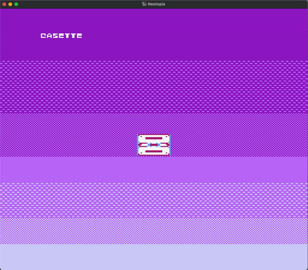

<sub>**Figure 20**: Personally, I think it looks super cute.</sub>

### Part 5: _Conclusion_

If I had to pick the single hobby project that has given the most grief—and simply because its documentation is so decentralised and obscure—it would be NES development. I think, honestly, that this is a shame. The practice of teaching and learning about concepts like memory management and computer architecture can be enhanced and made fun by simply relating it back to these very real, nostalgic, and thus relatable, practices. At least, for a lot of us who grew up with video games from the NES, SNES, and even Nintendo 64 era, being this intimately acquainted with the machines that brought us so much joy makes us appreciate them even more.

You will surely have noticed that what I have talked about in this lecture is but a small part of what went into creating this ROM (the complete version can be found [**here**](https://github.com/sebastianromerocruz/CASSETTE.nes)). If you would like to know more about my journey in self-learning NES development, click [**here**](https://github.com/sebastianromerocruz/famicom-6502). Either way, I hope you have enjoyed yourself. Thank you for listening 💜.